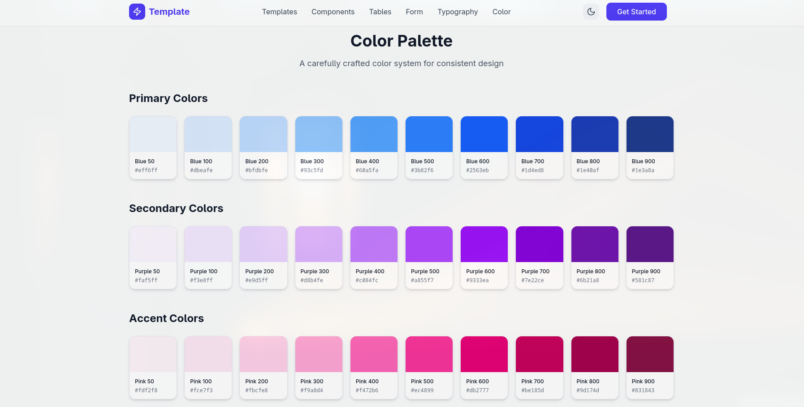

# React TailwindCSS Template

A modern and scalable **React + Tailwind CSS** starter template designed to speed up frontend development with a clean structure, reusable components, and responsive design out of the box.

## 📸 Preview

### Homepage


### Components


### Typography


### Color



## 🚀 Features

- ⚛️ React with modern best practices
- 🎨 Tailwind CSS for utility-first styling
- 🧩 Reusable UI components
- 🌗 Theme support using React Context
- 📱 Fully responsive layout
- 🧱 Well-structured and scalable folder architecture
- ⚡ Fast development setup

## 📁 Project Structure

```text
src/
├── app/
│   ├── components/
│   │   ├── fallback/
│   │   │   └── ImageWithFallback.tsx
│   │   └── ui/
│   │       ├── ColorPalette.tsx
│   │       ├── ComponentsLibrary.tsx
│   │       ├── Footer.tsx
│   │       ├── FormSection.tsx
│   │       ├── Hero.tsx
│   │       ├── Navbar.tsx
│   │       ├── TableSection.tsx
│   │       ├── TemplateShowcase.tsx
│   │       └── TypographySection.tsx
│   ├── context/
│   │   └── ThemeContext.tsx
│   └── App.tsx
├── styles/
│   ├── index.css
│   ├── tailwind.css
│   └── theme.css
├── main.tsx
public/
index.html
```

## 🛠️ Installation

1. Clone this repository

```bash
git clone https://github.com/ryanannda/Template-React-TailwindCSS.git
```

2. Install dependencies

```bash
npm install
```

3. Run the development server

```bash
npm run dev
```

## 📦 Build for Production

```bash
npm run build
```

## 🎨 Styling

- Tailwind configuration is managed through `tailwind.css`
- Global styles live in `index.css`
- Theme variables are defined in `theme.css`

## 🧠 Context

- `ThemeContext` handles theme state and global UI behavior

## 📌 Use Cases

- Landing pages
- Dashboard UI
- Design system playground
- Frontend starter for real-world projects

## 🤝 Contributing

Contributions are welcome! Feel free to open issues or submit pull requests.

## 📄 License

This project is licensed under the MIT License.
